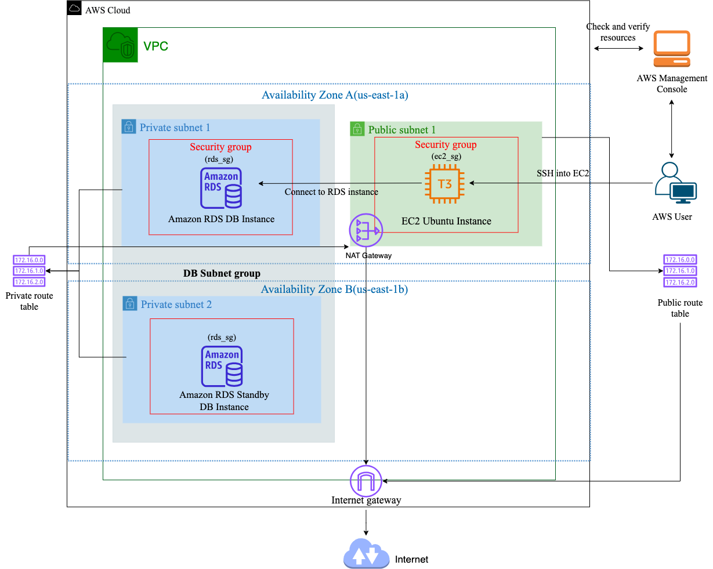

# Provisioning RDS MySQL and EC2 Instance with Terraform and CI/CD



This project provisions a secure AWS infrastructure using Terraform and CI/CD practices. It includes a VPC, subnets, an EC2 instance, an RDS MySQL database, an Internet Gateway, and a NAT Gateway for private subnet internet access.

## Detailed guides:

- [Infrastructure Setup Documentation](https://medium.com/@ayolowo9/provisioning-mysql-rds-database-and-ec2-instance-using-terraform-4ed8a42f84e9)
- [CI/CD Workflow Documentation](https://medium.com/@ayolowo9/using-github-actions-to-deploy-terraform-configuration-to-aws-a-ci-cd-workflow-fff3b420ee62)

## Overview

- **VPC**: Centralized network to host all resources.
- **Subnets**: Public and private subnets spread across two availability zones for high availability.
- **NAT Gateway**: Provides internet access for private subnets while maintaining security.
- **EC2 Instance**: For administrative access, deployed in a public subnet.
- **RDS MySQL Database**: Hosted securely in private subnets.

## VPC Configuration

- **Virtual Private Cloud (VPC)**: Centralized network to host resources.
- **Subnets**:
  - Public subnets for internet-facing resources.
  - Private subnets for secure, internal resources.
- **Route Tables**: Configured for public and private subnets with appropriate route associations.
- **Internet Gateway**: Provides internet access for public subnets.
- **NAT Gateway**: Ensures private subnets can access the internet without being directly exposed.

## EC2 Instance Configuration

- **Instance**: Ubuntu `t3.micro` instance deployed in a public subnet.
- **Security**:
  - Security group allows SSH access on port 22.
  - Ingress is restricted to specific IP addresses for enhanced security.
- **Key Pair**: Secure SSH key pair generated locally.

## RDS MySQL Configuration

- **Instance**: MySQL RDS database hosted in private subnets.
- **Security**:
  - Security group allows access via port 3306.
  - Access restricted to the EC2 instance or specific IPs.

## Security Best Practices

- Restrict SSH access to specific IP addresses.
- Use IAM roles and policies for access control.
- Rotate credentials and key pairs regularly.
- Use AWS KMS or AWS Secrets Manager for key and secret management.

## Setup and Deployment

To provision the infrastructure:

1. Clone this repository.
2. Install [Terraform](https://developer.hashicorp.com/terraform/downloads).
3. Configure your AWS CLI credentials locally.
4. Navigate to the project directory.
5. Run the following commands:
   ```bash
   terraform init
   terraform validate
   terraform plan
   terraform apply
   ```
6. Confirm the terraform apply step when prompted.

## Accessing Resources

### SSH Access to EC2

Use the `.pem` file generated during the setup to SSH into the EC2 instance:

```bash
ssh -i "ec2_key_pair.pem" ubuntu@<EC2-PUBLIC-IP>
```

### Connecting to RDS

```bash
mysql -h <RDS-ENDPOINT> -P 3306 -u <USERNAME> -p
```

## Conclusion

This project demonstrates a best-practice approach to creating a secure and scalable AWS infrastructure using Terraform and CI/CD. Contributions and feedback are welcome!
